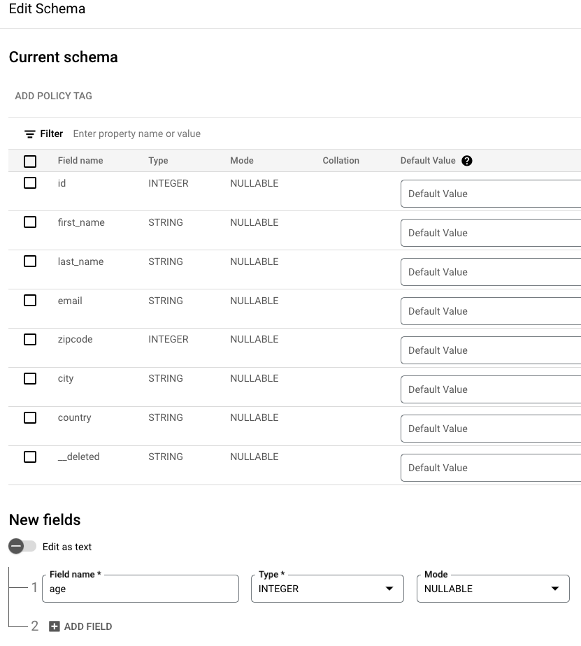

Pub/Sub Direct to BigQuery Lab

## 1. Prerequisites 

### 1.1. Create a project
Note the project ID. <br>
We will need this for the rest of the lab.

### 1.2. Grant yourself Security Administrator role<br>
This is needed for the networking setup.<br>
Go to Cloud IAM and through the UI, grant yourself security admin role.

### 1.3. Grant yourself Organization Policy Administrator at an Organization level<br>
This is needed to set project level policies<br>
In the UI, set context to organization level (instead of project)<br>
Go to Cloud IAM and through the UI, grant yourself Organization Policy Administrator at an Organization level.<br>
Don't forget to set the project back to the project you created in Step 1 above in the UI.

## 2. Details about the environment that is setup by this module

### 2.1. Products/services used in the lab
The following services and resources will be created via Terraform scripts:

1. VPC, Subnetwork and NAT rules
2. IAM permissions for user principals and Google Managed default service accounts
3. CloudSQL mysql instance; test database and peoples table
4. Pub/Sub topic and BQ Subscription for Debezium CDC Data Updates
5. Pub/Sub topic and BQ Subscription for Debezium CDC DDL Updates
6. BigQuery Dataset and peoples table
7. Composer Environment with Pre-Defined Environment Variables

### 2.2. Tooling

1. Terraform for automation
2. Cloud Shell for executing Terraform

<hr>

## 3. Provision the GCP environment 

This section covers creating the environment via Terraform from Cloud Shell. 
1. Launch cloud shell
2. Clone this git repo
3. Provision foundational resources such as Google APIs and Organization Policies
4. Provision the GCP data Analytics services and their dependencies for the lab

### 3.1. Create a Cloud Shell Session
Instructions for launching and using cloud shell are available [here](https://cloud.google.com/shell/docs/launching-cloud-shell).

### 3.2. Clone the workshop git repo

```
cd ~
git clone https://github.com/j-f-oleary-bigdata/pubsub2bq
```

### 3.3. About the Terraform scripts

#### 3.3.1. Navigate to the Terraform directory
```
cd ~/pubsub2bq/
```

#### 3.3.2. Review the Terraform directory structure (& optionally, the content)

Browse and familiarize yourself with the layout and optionally, review the scripts for an understanding of the constructs as well as how dependencies are managed.

#### 3.3.3. What's involved with provisioning with Terraform

1. Define variables for use with Terraform
2. Initialize Terraform
3. Run a Terraform plan & study it
4. Apply the Terraform to create the environment
5. Validate the environment created

### 3.4. Provision the environment

#### 3.4.1. Define variables for use

Modify the below as appropriate for your deployment..e.g. region, zone etc. Be sure to use the right case for GCP region & zone.<br>
Make the corrections as needed below and then cut and paste the text into the Cloud Shell Session. <br>

```
PROJECT_ID=`gcloud config list --format "value(core.project)" 2>/dev/null`
PROJECT_NBR=`gcloud projects describe $PROJECT_ID | grep projectNumber | cut -d':' -f2 |  tr -d "'" | xargs`

echo "PROJECT_ID=$PROJECT_ID"
```

#### 3.4.2. Provision foundational resources

Foundational resources in this lab constitute Google APIs and Organizational Policies. 

##### 3.4.2.1. Initialize Terraform
The command below needs to run in cloud shell from ~/pubsub2bq/org_policy

```
cd ~/pubsub2bq/terraform/org_policy
terraform init
```

##### 3.4.2.2. Terraform deploy the resources

The terraform below first enables Google APIs needed for the demo, and then updates organization policies. It needs to run in cloud shell from ~/pubsub2bq/org_policy. <br>

**Time taken to complete:** <5 minutes

```
terraform apply \
  -var="project_id=${PROJECT_ID}" \
  --auto-approve
```

#### 3.4.3. Provision data analytics services & dependencies

##### 3.4.3.1. Initialize Terraform

Needs to run in cloud shell from ~/pubsub2bq/terraform
```
cd ~/pubsub2bq/terraform
terraform init
```

##### 3.4.3.2. Review the Terraform deployment plan

Needs to run in cloud shell from ~/pubsub2bq/terraform
```
terraform apply \
  -var="project_id=${PROJECT_ID}" \
  -var="project_nbr=${PROJECT_NBR}" \
  --auto-approve
```


**Time taken to complete:** <10 minutes


<hr>


## 4. Create mysql Resources and Start Debezium Server


### 4.1. Start CloudSQL Proxy
Needs to run in cloud shell from ~/pubsub2bq/terraform

```
nohup cloud-sql-proxy --port 3306 $PROJECT_ID:us-central1:mysql-pubsub2bq > sqlproxy.log 2>&1   &
```

### 4.1.1 Verify CloudSQL Proxy Started Correctly
Execute the command: 
```
admin_@cloudshell:~ (pubsub2bqv2)$ 
```

Output should look similar to this:
```
2023/11/26 23:28:13 Authorizing with Application Default Credentials
2023/11/26 23:28:13 [pubsub2bqv2:us-central1:mysql-pubsub2bq] Listening on 127.0.0.1:3306
2023/11/26 23:28:13 The proxy has started successfully and is ready for new connections!
```

### 4.2. Run mysql Commands to Populate people table
### 4.2.1 Extract the password from the properties file

Extract the mysql password with the following command
```
MYPASS=$(sed -n "/^debezium.source.database.password=/p" application.properties | sed "s/^debezium.source.database.password=//")
echo $MYPASS
```
<br>
<B>N.B.</B>This is for demo purposes only; typically you wouldn't store the password in clear text
<br>

### 4.2.2 Run the mysql script to create the database and tables in mysql
Run the following command:
```
mysql -u pubsub2bq -p${MYPASS} --host 127.0.0.1 < pubsub2bq.sql 
```

### 4.2.3 Verify that the mysql table is created and populated
Run the following command:
```
mysql -u pubsub2bq -p${MYPASS} --host 127.0.0.1
```
<br>
then from the sql prompt run the following commmads:
```
select * from test.people;
```
<br>
Output should look similar to this:
```
<br>
+-----+------------+-------------+---------------+---------+-----------+---------+<br>
| id  | first_name | last_name   | email         | zipcode | city      | country |<br>
+-----+------------+-------------+---------------+---------+-----------+---------+<br>
| 990 | Tom        | BagofDonuts | tom@corp.com  |    2174 | Arlington | USA     |<br>
| 991 | Phil       | BagofDonuts | phil@corp.com |    2174 | Arlington | USA     |<br>
| 992 | Ted        | BagofDonuts | ted@corp.com  |    2174 | Arlington | USA     |<br>
+-----+------------+-------------+---------------+---------+-----------+---------+<br>
3 rows in set (0.03 sec)<br>
```
<br>

### 4.1. Run the Debezium Server
The command below needs to run in cloud shell from ~/pubsub2bq/terraform/debezium-server

```
cd ~/pubsub2bq/terraform/~/pubsub2bq/terraform/debezium-server
./run.sh
```

### 4.1.1
Stop the debezium server by hitting ctrl-c in the cloud-shell terminal window

### 4.2. Validate the data made it to BigQuery

Run the query below from the cloud shell:
```
bq query "select * from ${PROJECT_ID}.pubsub2bq_dataset.people"
```
<br>
The results should look similar to this:
```
<br>
+-----+------------+-------------+---------------+---------+-----------+---------+-----------+<br>
| id  | first_name |  last_name  |     email     | zipcode |   city    | country | __deleted |<br>
+-----+------------+-------------+---------------+---------+-----------+---------+-----------+<br>
| 990 | Tom        | BagofDonuts | tom@corp.com  |    2174 | Arlington | USA     | false     |<br>
| 991 | Phil       | BagofDonuts | phil@corp.com |    2174 | Arlington | USA     | false     |<br>
| 992 | Ted        | BagofDonuts | ted@corp.com  |    2174 | Arlington | USA     | false     |<br>
<br>
```

## 5. Modify the mysql table schema for the 'people' table and add a new record


### 5.1.0 Update the schema and add data
Run the following command:
```
mysql -u pubsub2bq -p${MYPASS} --host 127.0.0.1
```
<br>
then from the sql prompt run the following commmads:
```
use test;
alter table people ADD column phone VARCHAR(255);
INSERT INTO people (id, first_name, last_name,email,zipcode,city,country,phone) 
values (994, "Tim", "BagofDonuts","tim@corp.com", 2174 ,"Arlington","USA","508-555-1212");
select * from people;
```
<br>
The results should look similar to the following:
[Notice the new 'phone' column]
```
+-----+------------+-------------+---------------+---------+-----------+---------+--------------+
| id  | first_name | last_name   | email         | zipcode | city      | country | phone        |
+-----+------------+-------------+---------------+---------+-----------+---------+--------------+
| 990 | Tom        | BagofDonuts | tom@corp.com  |    2174 | Arlington | USA     | NULL         |
| 991 | Phil       | BagofDonuts | phil@corp.com |    2174 | Arlington | USA     | NULL         |
| 992 | Ted        | BagofDonuts | ted@corp.com  |    2174 | Arlington | USA     | NULL         |
| 994 | Tim        | BagofDonuts | tim@corp.com  |    2174 | Arlington | USA     | 508-555-1212 |
+-----+------------+-------------+---------------+---------+-----------+---------+--------------+
```

### 5.1.0 Run the debezium server and make sure the data made it to BigQuery

The command below needs to run in cloud shell from ~/pubsub2bq/terraform/debezium-server

```
cd ~/pubsub2bq/terraform/~/pubsub2bq/terraform/debezium-server
./run.sh
```

### 5.1.1
Stop the debezium server by hitting ctrl-c in the cloud-shell terminal window

### 5.2.0 Validate the data made it to BigQuery

Run the query below from the cloud shell:
```
bq query "select * from ${PROJECT_ID}.pubsub2bq_dataset.people"
```
<br>
The results should look similar to this: <br>
[Notice there is not 'phone' column]
```
<br>
+-----+------------+-------------+---------------+---------+-----------+---------+-----------+<br>
| id  | first_name |  last_name  |     email     | zipcode |   city    | country | __deleted |<br>
+-----+------------+-------------+---------------+---------+-----------+---------+-----------+<br>
| 990 | Tom        | BagofDonuts | tom@corp.com  |    2174 | Arlington | USA     | false     |<br>
| 991 | Phil       | BagofDonuts | phil@corp.com |    2174 | Arlington | USA     | false     |<br>
| 992 | Ted        | BagofDonuts | ted@corp.com  |    2174 | Arlington | USA     | false     |<br>
| 994 | Tim        | BagofDonuts | tim@corp.com  |    2174 | Arlington | USA     | false     |<br>
```

### 5.3.0 Pull the results from the non bq subscription and note the payload
Run the query below from the cloud shell:
```
gcloud pubsub subscriptions pull pubsub2bq-nobq-sub
```
<br>
The results should look similar to this:
[Notice there is a 'phone' column but it is dropped from BigQuery because the 'phone' column is not in the topic schema]
```
DATA: {"id":994,"first_name":"Tim","last_name":"BagofDonuts","email":"tim@corp.com","zipcode":2174,"city":"Arlington","country":"USA","phone":"508-555-1212","__deleted":"false"}
MESSAGE_ID: 9760094994850475
ORDERING_KEY: {"id":994}
ATTRIBUTES: googclient_schemaencoding=JSON
googclient_schemaname=projects/pubsub2bqv2/schemas/pubsub2bq-schema
googclient_schemarevisionid=3afd3cc8
```


## 6. Modify the bigquery table schema for the 'people' table and add a new record


### 6.1.0 Add the 'age' column to people table in BigQuery
In the BigQuery UI, edit the people table and add an 'age' column (as integer) as shown below:



### 6.1.0 Add a new row to the mysql table
Run the following command:
```
mysql -u pubsub2bq -p${MYPASS} --host 127.0.0.1
```
<br>
then from the sql prompt run the following commmads:
```
use test;
INSERT INTO people (id, first_name, last_name,email,zipcode,city,country,phone) 
values (995, "Kim", "BagofDonuts","kim@corp.com", 2174 ,"Arlington","USA","508-555-1212");
select * from people;
```
<br>
The results should look similar to the following:
[Notice the new row of data]
```
<br>
+-----+------------+-------------+---------------+---------+-----------+---------+--------------+<br>
| id  | first_name | last_name   | email         | zipcode | city      | country | phone        |<br>
+-----+------------+-------------+---------------+---------+-----------+---------+--------------+<br>
| 990 | Tom        | BagofDonuts | tom@corp.com  |    2174 | Arlington | USA     | NULL         |<br>
| 991 | Phil       | BagofDonuts | phil@corp.com |    2174 | Arlington | USA     | NULL         |<br>
| 992 | Ted        | BagofDonuts | ted@corp.com  |    2174 | Arlington | USA     | NULL         |<br>
| 994 | Tim        | BagofDonuts | tim@corp.com  |    2174 | Arlington | USA     | 508-555-1212 |<br>
| 995 | Kim        | BagofDonuts | kim@corp.com  |    2174 | Arlington | USA     | 508-555-1212 |<br>
+-----+------------+-------------+---------------+---------+-----------+---------+--------------+<br>
5 rows in set (0.03 sec)<br>
<br>
```


### 6.1.1 Run the debezium server and make sure the data made it to BigQuery

The command below needs to run in cloud shell from ~/pubsub2bq/terraform/debezium-server

```
cd ~/pubsub2bq/terraform/~/pubsub2bq/terraform/debezium-server
./run.sh
```

### 6.1.2
Stop the debezium server by hitting ctrl-c in the cloud-shell terminal window


### 6.2.0 Validate the data made it to BigQuery

Run the query below from the cloud shell:
```
bq query "select * from ${PROJECT_ID}.pubsub2bq_dataset.people"
```
<br>
The results should look similar to this: <br>
[Notice there is a new row for 'id' of '995'<br>
```
<br>
+-----+------------+-------------+---------------+---------+-----------+---------+-----------+------+<br>
| id  | first_name |  last_name  |     email     | zipcode |   city    | country | __deleted | age  |<br>
+-----+------------+-------------+---------------+---------+-----------+---------+-----------+------+<br>
| 995 | Kim        | BagofDonuts | kim@corp.com  |    2174 | Arlington | USA     | false     | NULL |<br>
| 990 | Tom        | BagofDonuts | tom@corp.com  |    2174 | Arlington | USA     | false     | NULL |<br>
| 991 | Phil       | BagofDonuts | phil@corp.com |    2174 | Arlington | USA     | false     | NULL |<br>
| 992 | Ted        | BagofDonuts | ted@corp.com  |    2174 | Arlington | USA     | false     | NULL |<br>
| 994 | Tim        | BagofDonuts | tim@corp.com  |    2174 | Arlington | USA     | false     | NULL |<br>
+-----+------------+-------------+---------------+---------+-----------+---------+-----------+------+<br>
<br>
```

## 7. Modify the bigquery table schema for the 'people' table to remove a column and add data


### 7.1.0 Remove the 'age' and 'zipcode' column to people table in BigQuery
Run the query below from the cloud shell:
```
bq rm --table "pubsub2bq_dataset.people"
```

### 7.1.1 Create the new table in BigQuery 
Run the query below from the cloud shell from ~/pubsub2bq/terraform/:
```
bq mk \
 --table \
 --expiration 3600 \
 pubsub2bq_dataset.people \
bq_schemav2.json
```


### 7.1.2 Add a new row to the mysql table
Run the following command:
```
mysql -u pubsub2bq -p${MYPASS} --host 127.0.0.1
```
<br>
then from the sql prompt run the following commmads:
```
use test;
INSERT INTO people (id, first_name, last_name,email,zipcode,city,country,phone) 
values (996, "Sam", "BagofDonuts","sam@corp.com", 2174 ,"Arlington","USA","508-555-1212");
select * from people;
```
<br>
The results should look similar to the following:
[Notice the new row of data]
```
<br>
+-----+------------+-------------+---------------+---------+-----------+---------+--------------+<br>
| id  | first_name | last_name   | email         | zipcode | city      | country | phone        |<br>
+-----+------------+-------------+---------------+---------+-----------+---------+--------------+<br>
| 990 | Tom        | BagofDonuts | tom@corp.com  |    2174 | Arlington | USA     | NULL         |<br>
| 991 | Phil       | BagofDonuts | phil@corp.com |    2174 | Arlington | USA     | NULL         |<br>
| 992 | Ted        | BagofDonuts | ted@corp.com  |    2174 | Arlington | USA     | NULL         |<br>
| 994 | Tim        | BagofDonuts | tim@corp.com  |    2174 | Arlington | USA     | 508-555-1212 |<br>
| 995 | Kim        | BagofDonuts | kim@corp.com  |    2174 | Arlington | USA     | 508-555-1212 |<br>
| 996 | Sam        | BagofDonuts | sam@corp.com  |    2174 | Arlington | USA     | 508-555-1212 |<br>
+-----+------------+-------------+---------------+---------+-----------+---------+--------------+<br>
6 rows in set (0.03 sec)<br>
<br>
```


### 7.1.3 Run the debezium server and make sure the data made it to BigQuery

The command below needs to run in cloud shell from ~/pubsub2bq/terraform/debezium-server

```
cd ~/pubsub2bq/terraform/~/pubsub2bq/terraform/debezium-server
./run.sh
```

### 7.1.4
Stop the debezium server by hitting ctrl-c in the cloud-shell terminal window


### 7.2.0 Validate the data made it to BigQuery

Run the query below from the cloud shell:
```
bq query "select * from ${PROJECT_ID}.pubsub2bq_dataset.people"
```
<br>
You get zero results because there was a schema mismatch as shown below:


